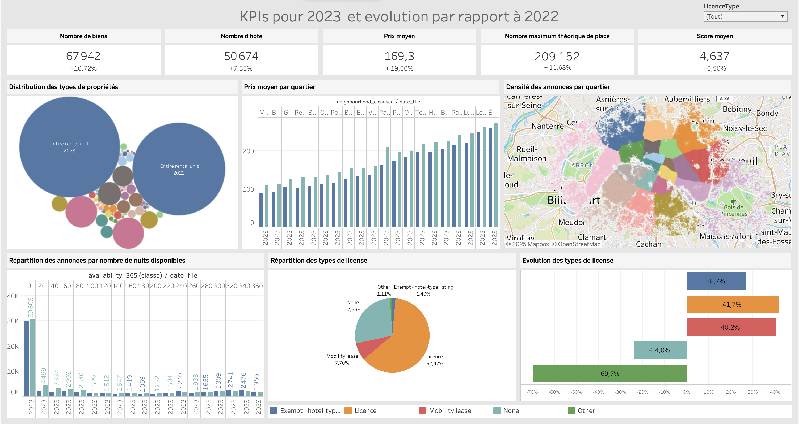

# 📊 Airbnb vs Mairie de Paris : Analyse des Mesures Régulatrices

## 📌 Contexte et Problématique
La ville de Paris fait face à une **prolifération des locations Airbnb**, soulevant plusieurs enjeux :
- **🏨 Concurrence Déloyale** : Impact sur l'hôtellerie traditionnelle.
- **📈 Hausse des Loyers** : Réduction des logements disponibles pour les Parisiens.
- **🔊 Nuisances Sonores** : Rotation fréquente des touristes.
- **💰 Impact Fiscal** : Locations non déclarées réduisant les recettes fiscales.

### 🎯 **Question de Recherche**
> 📌 *Les mesures prises par la Mairie de Paris ont-elles permis de réguler efficacement le marché des locations temporaires ?*

---

## 📊 **Méthodologie et Analyse**
### **📁 Données utilisées**
- **Période** : 2022 et 2023.
- **Géographie** : Paris.
- **Taille** : **173k lignes, 69 colonnes** (Données issues d'Airbnb).
- **Indicateurs clés** : Nombre de biens, hôtes, prix moyen, licences, etc.

### **🛠 Visualisations et Justifications**
| **Visualisation** | **Objectif** |
|------------------|-------------|
| **KPIs** | Suivi des tendances Airbnb (Nombre de biens, prix moyen, etc.) |
| **Graphique en Bulles** | Évolution des types de propriétés 2022 vs 2023 |
| **Bar Chart** | Prix moyen par quartier |
| **Carte Colorée** | Densité des annonces par quartier |
| **Histogramme** | Répartition des annonces selon le nombre de nuits disponibles |
| **Pie Chart** | Répartition des types de licences |
| **Stacked Bar Chart** | Évolution des types de licence |

---

## 🖼️ **Tableau Final**

---

## 🔍 **Synthèse des Insights**
✅ **Impact des régulations municipales :**
1. 📈 **Croissance continue du marché** malgré les restrictions.
2. 🎫 **Meilleure conformité** avec une hausse des annonces avec licences.
3. 💰 **Augmentation des prix** dans certains quartiers.
4. 🏠 **Limite des 120 jours respectée** par la majorité des annonces.
5. 🌍 **Forte concentration dans certains quartiers**, créant une pression sur le marché immobilier.

### 📌 **Conclusion & Recommandations**
- **Les régulations ont permis une meilleure conformité, mais n'ont pas freiné la croissance d'Airbnb.**
- **La mairie pourrait envisager des ajustements** pour limiter encore l'impact sur les loyers et la concurrence avec l’hôtellerie traditionnelle.
- **Un suivi continu et un dialogue avec les acteurs du secteur sont essentiels.**

---

## 📂 **Fichiers du projet**
- 📊 **[`airbnb_vs_mairie_paris.twb`](airbnb_vs_mairie_paris.twb)** : Fichier Tableau contenant les visualisations.
- 🖼️ **[`dashboard_airbnb_vs_mairie_paris.png`](dashboard_airbnb_vs_mairie_paris.png)** : Capture du tableau final.
- 📝 **`README.md`** : Explication complète du projet.

---
## 📧 **Contact & Contributions**
Si vous avez des questions ou souhaitez discuter du projet :
- **📩 Email** : nada.fakihani@gmail.com
- **🔗 LinkedIn** : [Nada Fakihani](https://www.linkedin.com/in/nadafakihani/)

📌 **Contributions bienvenues** ! Feel free to submit suggestions.
